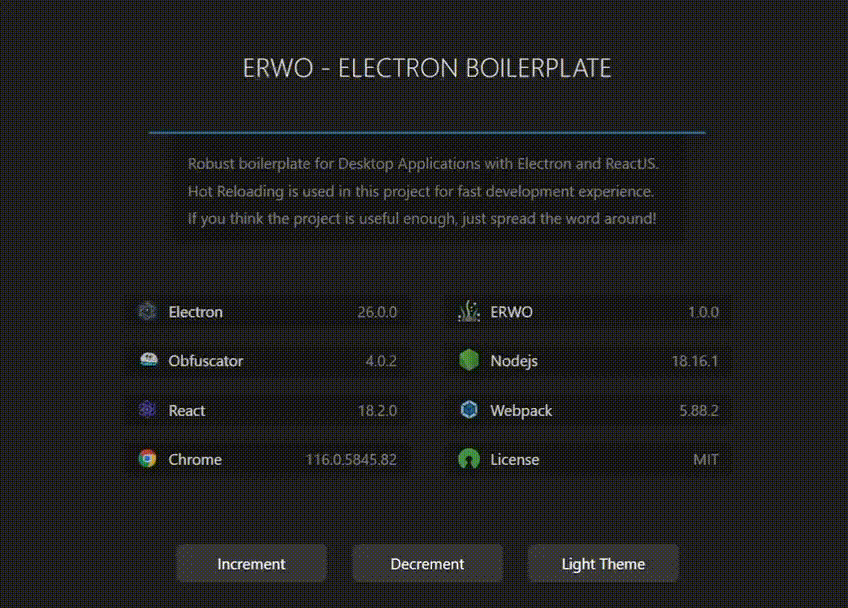

# Electron React Webpack Obfuscator (With react-refresh)

A minimal secure boilerplate for writing Desktop Applications using [Electron](https://www.electronjs.org/), [React](https://reactjs.org/), [Webpack](https://webpack.js.org/) & [Obfuscator](https://obfuscator.io/) with react-refresh.

<br>


Special thanks to [electron-react-webpack-typescript-2023](https://github.com/codesbiome/electron-react-webpack-typescript-2023/) for their typescript version.

<br>

**Following are the list of features it provides :**

-   No Typescript in boilerplate
-   Obfuscation of source code after compilation
-   [IPC](https://www.electronjs.org/docs/latest/api/ipc-main) call example

<br>

# Core Features

-   🌟 Electron
-   ⚛️ React
-   🌀 Obfuscator
-   🥗 SASS/SCSS Loader
-   🎨 CSS Loader
-   📸 Image Loader
-   🆎 Font Loader
-   🧹 ESLint
-   📦 Electron Forge
-   📐 IPC call example
-   🔱 Webpack & Configuration
-   🧩 Aliases for Project Paths
-   🔥 React Fast Refresh + Webpack HMR
-   🌞 Dark Mode + Light Mode (Theme)
-   🎁 Package Bundling (Distribution / Release)

<br>

## Custom Aliases for Paths

We can use predefined aliases for `import` paths already used in this project. Following are the details:

| Alias         | Target Path                |
| ------------- | -------------------------- |
| `@assets`     | `/assets`                  |
| `@main`       | `/src/main`                |
| `@renderer`   | `/src/renderer`            |
| `@common`     | `/src/common`              |
| `@src`        | `/src`                     |
| `@components` | `/src/renderer/components` |

<br><br>

# Installation

```bash
git clone https://github.com/lastelok/electron-react-webpack-obfuscator-2023
```

<br>

Install dependencies using [pnpm](https://pnpm.io/) or [yarn](https://www.npmjs.com/package/yarn) or [npm](https://www.npmjs.com/) :

```bash
# using pnpm
pnpm install

# or using yarn
yarn install

# or using npm
npm install
```

<br />

## Start : Development

To develop and run your application, you need to run following command.
<br />
Start electron application for development :

```bash
npm run start
```

<br />

## Lint : Development

To lint application source code using ESLint via this command :

```bash
npm run lint
```

<br />

## Package : Production

Customize and package your Electron app with OS-specific bundles (.app, .exe etc)

```bash
npm run package
```

<br />

## Make : Production

Making is a way of taking your packaged application and making platform specific distributables like DMG, EXE, or Flatpak files (amongst others).

```bash
npm run make
```

<br />

## Publish : Production

Publishing is a way of taking the artifacts generated by the `make` command and sending them to a service somewhere for you to distribute or use as updates. (This could be your update server or an S3 bucket)

```bash
npm run publish
```

<br />

## Packager & Makers Configuration

This provides an easy way of configuring your packaged application and making platform specific distributables like DMG, EXE, or Flatpak files.

This configurations file is available in :

```bash
tools/forge/forge.config.js
```

For further information, you can visit [Electron Forge Configuration](https://www.electronforge.io/configuration)
